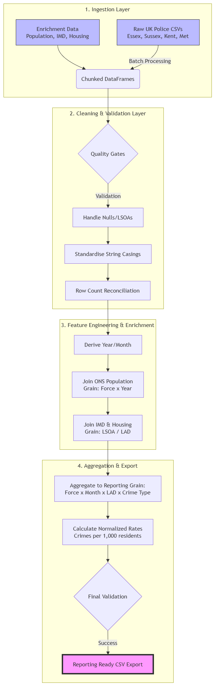

# UK Police Crime Data Engineering Pipeline

An end-to-end ETL pipeline in Python and Pandas. It takes **~4.9 million raw UK Police crime records** from four police forces over three years, joins them with ONS demographic and socioeconomic data, and produces a **validated, BI-ready reporting dataset** for Power BI.

> Built as part of the **Rockborne Data Training Programme** (Cohort 20), July 2026.


---

## At a glance

| | |
|---|---|
| **Scope** | Essex, Kent, Sussex and Metropolitan Police Service, June 2023 to May 2026 (36 months) |
| **Input** | 144 monthly street-crime CSVs (~4.9M rows, ~2.1 GB) + 3 ONS/government enrichment datasets |
| **Output** | [`BI_Reporting_Dataset_Final.csv`](BI_Reporting_Dataset_Final.csv): ~47,500 rows at **Force × Month × Local Authority × Crime Type** |
| **Coverage** | 331 local authority districts, 14 crime categories |
| **Key metric** | Crimes per 1,000 force residents |
| **Quality gates** | Row-count reconciliation on every join, zero duplicates at reporting grain, no nulls in core metrics (enforced with `assert`) |

## Business problem

A police analytics unit needs one trusted dataset so leadership can:

- **Compare forces directly**, using rates normalised by population rather than raw counts
- **Track seasonal trends** by month and crime type
- **Add socioeconomic context** to crime (deprivation, earnings, housing affordability)

The raw data is spread across dozens of monthly folders, contains duplicates and missing location codes, and uses different keys from the enrichment sources. This pipeline fixes those problems in a repeatable, documented way.

## Pipeline architecture



| Layer | What it does | Key techniques |
|---|---|---|
| **1. Batch ingestion** | Walks the month/force folder tree, filters to the project date range and target forces, and loads each file separately | `os.walk`, `glob`, column pruning on read (`usecols`), per-file row logging |
| **2. Cleaning & validation** | Standardises column names, handles missing LSOA/crime IDs and removes duplicates | Missing LSOAs flagged as `unmapped_lsoa` instead of dropped. Rows **without** a crime ID (e.g. anti-social behaviour) are excluded from deduplication so real incidents are kept. **384,264 exact duplicates removed** |
| **3. Feature engineering & enrichment** | Derives time attributes and joins three external datasets at the right grain | Population at *Force × Year*, IMD at *LSOA*, housing/earnings at *LAD × Year*. Left joins with `assert` checks that row counts stay the same |
| **3.2 ONS workbook parsing** | Turns an 18-sheet, human-readable ONS Excel workbook into one tidy table (~61k rows) | Metadata mapping per sheet, regex year-column detection, wide-to-long `pd.melt`, stripping suppression symbols (`[x]`, `:`) |
| **4. Aggregation** | Reduces millions of event rows to the reporting grain and calculates normalised rates | `groupby().agg()`, `crimes_per_1k_force_residents` |
| **5. Final validation & export** | Checks grain uniqueness and core-metric completeness, then exports | Pipeline stops on failure (`assert`), CSV export |

## Engineering decisions worth noting

- **Preserving crime volume:** Records with no LSOA code (~44k) can't be mapped to a local area. They are kept and flagged rather than dropped, so force-level totals stay correct.
- **Careful deduplication:** A blanket `drop_duplicates()` would wrongly merge separate anti-social behaviour incidents, which have no crime ID. Only rows with an ID are deduplicated.
- **Handling time mismatches:** ONS population estimates only go up to mid-2024, and housing data up to 2025. The latest year is carried forward (2024 population for 2025–26, 2025 housing for 2026), and this assumption is documented.
- **Join-key standardisation:** LAD names are taken from `lsoa_name` (e.g. `Basildon 001A` becomes `Basildon`) and normalised (`&` to `and`, punctuation removed, lower-case) to improve the housing join match rate.
- **Checks built into the pipeline:** Every join confirms that no rows were duplicated by many-to-many matches. The final layer checks the output before export and stops the run if a check fails.

## Output data dictionary

`BI_Reporting_Dataset_Final.csv`: one row per **police force × month × local authority district × crime type**.

| Column | Type | Source | Description |
|---|---|---|---|
| `reported_by` | string | data.police.uk | Police force (e.g. `Essex Police`) |
| `month` | string | data.police.uk | Reporting month, `YYYY-MM` |
| `year` | int | Derived | Year from `month`, used to join annual enrichment data |
| `lad_name` | string | Derived | Local Authority District, taken from `lsoa_name` |
| `crime_type` | string | data.police.uk | Crime category (e.g. `Burglary`, `Vehicle crime`) |
| `crime_count` | int | Aggregated | Number of recorded crimes in the group |
| `force_population` | int | ONS | Resident population of the Police Force Area for that year |
| `median_imd_decile` | float | IMD | Median deprivation decile of the LSOAs in the group (1 = most deprived) |
| `median_house_price` | float | ONS | Median house price in the LAD (£) |
| `median_earnings` | float | ONS | Median workplace-based annual earnings in the LAD (£) |
| `median_affordability_ratio` | float | ONS | Median house price ÷ median earnings |
| `crimes_per_1k_force_residents` | float | Calculated | `crime_count / force_population × 1000` |

Enrichment columns are empty for around 3% of rows. These are mainly the `Unmapped` location group and LADs whose names don't match the ONS data.

## Data sources

All data is publicly available under the [Open Government Licence v3.0](https://www.nationalarchives.gov.uk/doc/open-government-licence/version/3/).

| Dataset | Used for | Included in repo? |
|---|---|---|
| [UK Police street-level crime data](https://data.police.uk/data/) | Primary crime records | **No** (~2.1 GB, see below) |
| [ONS population estimates for Police Force Areas, mid-1991 to mid-2024](https://www.ons.gov.uk/peoplepopulationandcommunity/populationandmigration/populationestimates/adhocs/3194populationestimatesforpoliceforceareasinenglandandwalesbysingleyearofageandsexmid1991tomid2024) | Population / normalisation | Yes: `enrichment_data/population_by_police_force.xlsx` |
| [English Indices of Deprivation 2025 (File 7: ranks, scores, deciles)](https://www.gov.uk/csv-preview/691ded56d140bbbaa59a2a7d/File_7_IoD2025_All_Ranks_Scores_Deciles_Population_Denominators.csv) | LSOA deprivation decile | Yes: `enrichment_data/Indicies_of_deprivation.csv` |
| [ONS ratio of house price to workplace-based earnings (lower quartile and median)](https://www.ons.gov.uk/peoplepopulationandcommunity/housing/datasets/ratioofhousepricetoworkplacebasedearningslowerquartileandmedian) | Earnings, house prices, affordability | Yes: `enrichment_data/employment_housing_demographic_metrics.xlsx` |

## Repository structure

```text
.
├── crime_data_engineering_pipeline.ipynb   # The full pipeline (all 5 layers, documented)
├── BI_Reporting_Dataset_Final.csv          # Final BI-ready output
├── enrichment_data/                        # ONS & IMD enrichment datasets
├── images/pipeline_workflow_diagram.png    # Architecture diagram
├── requirements.txt
└── uk_police_data/                         # NOT in repo: download separately (see below)
```

## How to run

1. **Clone and install dependencies**
   ```bash
   git clone https://github.com/ry-an88/UK_Police_Crime_Data.git
   cd UK_Police_Crime_Data
   pip install -r requirements.txt
   ```
2. **Download the raw police data** from [data.police.uk/data](https://data.police.uk/data/):
   - Date range: **June 2023 to May 2026**
   - Forces: **Essex, Kent, Sussex, Metropolitan Police Service**
   - Tick **Include crime data**
3. **Unzip** so the monthly folders sit under `uk_police_data/`:
   ```text
   uk_police_data/2023-06/2023-06-essex-street.csv
   uk_police_data/2023-06/2023-06-kent-street.csv
   ...
   ```
4. **Run the notebook** from top to bottom:
   ```bash
   jupyter notebook crime_data_engineering_pipeline.ipynb
   ```
   The pipeline writes `BI_Reporting_Dataset_Final.csv` to the project root.

> Memory: the full street-level dataset uses about 400 MB in pandas after column pruning. A machine with 8 GB+ RAM is recommended.

## Skills demonstrated

**Data engineering:** ETL design, batch ingestion, schema standardisation, multi-source joins at mixed grains, data-quality gates, parsing messy Excel files into tidy tables.
**Data analysis:** normalised metrics, choosing aggregation grain, handling missing data and time mismatches in a way that can be justified.
**Tooling:** Python, pandas, NumPy, regex, Jupyter, preparing data for Power BI.

## Possible extensions

- Refactor the notebook layers into a Python package with unit tests (`pytest`) and a CLI entry point
- Add Outcomes and Stop & Search datasets to the reporting model
- Load into a warehouse (e.g. PostgreSQL / DuckDB) as a star schema instead of a flat CSV
- Orchestrate monthly incremental loads (e.g. Airflow / Prefect) using the data.police.uk API
- Build and publish the accompanying Power BI dashboard

## Author

**Dip Raiyan**, Rockborne Data Training Programme, Cohort 20
<!-- Add your LinkedIn URL here: [LinkedIn](https://www.linkedin.com/in/your-profile) -->
