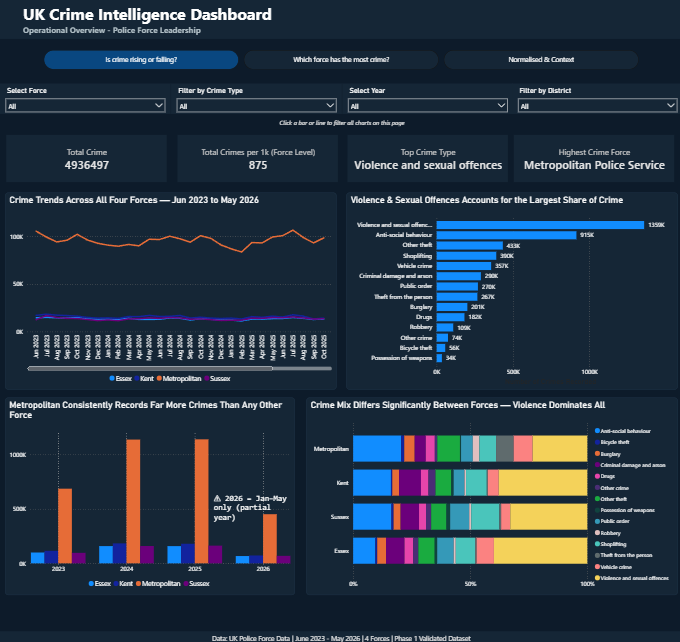
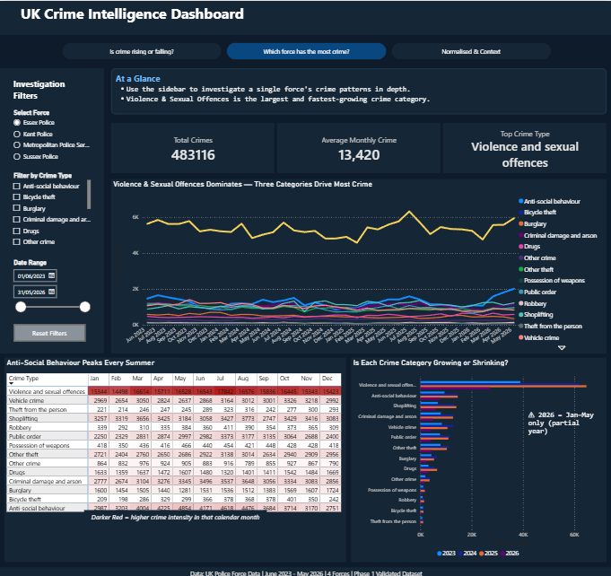
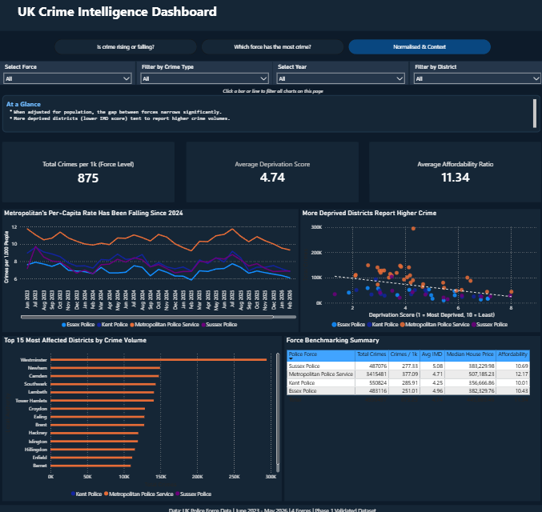

# UK Crime Intelligence Dashboard (Power BI)

**Phase 2** of the project. This Power BI dashboard is built on the [`BI_Reporting_Dataset_Final.csv`](../BI_Reporting_Dataset_Final.csv) produced by the [Phase 1 data engineering pipeline](../README.md).

### 📄 [View the full dashboard (PDF)](Crime_Analysis_Dashboard.pdf)

> Screenshots of each page are below. The PDF contains the complete report.
<!-- Optional: add a walkthrough video link here, e.g. 🎥 [Watch a 2-minute walkthrough](https://youtu.be/...) -->

*The dashboard was published to the Power BI Service during the programme. Public web embedding is turned off for that organisation's account, so a PDF export and screenshots are provided instead.*


---

## Purpose

Police force leadership (senior officers, crime analysis leads and resource planners) needs a **self-service** way to see what is happening, where, and how it is changing, and to compare their force fairly with others.

The brief described these users as **time-poor and non-technical**. Every design choice was tested against one question: *can a senior officer understand this page within 5 seconds?*

**Coverage:** Essex, Kent, Sussex and the Metropolitan Police Service · June 2023 to May 2026 · **4.94 million recorded crimes** · 14 crime categories

## Dashboard pages

Each page is named after the question it answers, and the page navigation buttons use the same wording.

### Page 1: "Is crime rising or falling?" (Overview)



- **KPI cards:** Total crimes, crimes per 1,000 residents, top crime type, highest-crime force
- **Trend line:** monthly crime by force, Jun 2023 to May 2026
- **Force comparison:** annual totals by force (clustered column chart)
- **Category breakdown:** total crimes by crime type, plus a 100% stacked bar showing each force's crime mix
- **Global filters:** force, crime type, year, district

### Page 2: "Which force has the most crime?" (Force deep dive)



- **Investigation sidebar** for focusing on a single force, crime type and date range
- **Seasonal heatmap** (matrix with conditional formatting): crime type × calendar month
- **Category trends** over time, and a year-by-year chart showing whether each category is **growing or shrinking**
- **Reset bookmark** button to clear all filters

### Page 3: "Normalised & Context" (Fair comparison)



- **Per-capita trend:** crimes per 1,000 residents by force, which removes the effect of population size
- **Deprivation scatter plot:** average IMD decile vs crime volume for each local authority district
- **Top 15 most affected districts** by crime volume
- **Force benchmarking table:** volume, per-capita rate, IMD, house price and affordability side by side

## Key insights

| # | Insight | Where to see it |
|---|---|---|
| 1 | **The Metropolitan Police accounts for 69% of all crime** across the four forces (3.42M of 4.94M), 6–7× the volume of any other force. | Page 1 |
| 2 | **Once adjusted for population, the gap narrows.** The Met averages ~10.5 crimes per 1,000 residents per month, compared with ~7.0 to 7.9 for Essex, Sussex and Kent. | Page 3 |
| 3 | **Three categories drive 55% of demand:** Violence & sexual offences (27.5%), anti-social behaviour (18.5%) and other theft (8.8%). | Page 1 |
| 4 | **Anti-social behaviour rises every summer.** June to August averages about **41% more** ASB per month than December to February, and the pattern repeats each year, so it can be planned for. | Page 2 heatmap |
| 5 | **Crime is concentrated in a few London boroughs.** Westminster (294k crimes) has nearly double the next-highest district, and the top 5 districts are all in London. | Page 3 |
| 6 | **More deprived districts record more crime** (lower IMD decile corresponds to higher volume). | Page 3 scatter |

### Recommendations for leadership

1. **Plan summer rosters in advance** for the predictable June to August increase in anti-social behaviour.
2. **Focus prevention resources** on violence & sexual offences, the largest category in every force.
3. **Target district-level interventions** in the highest-volume boroughs (Westminster, Newham, Camden, Southwark, Lambeth).
4. **Review the dashboard monthly** and use year-on-year change to spot worsening trends early.

## Design decisions

- **Titles state the finding.** For example, *"Anti-Social Behaviour Peaks Every Summer"* rather than *"Crime by Month"*.
- **Filter labels in plain English** (*Select Force*, *Filter by Crime Type*) rather than raw column names like `reported_by`.
- **"At a Glance" summary panel** at the top of each page, giving a 2 to 3 line briefing before any charts.
- **Consistent colour per force** across every visual, and a single layout pattern on all pages (header, navigation, filters, KPIs, detail).
- **Cross-filtering:** clicking a bar or line filters every visual on the page.
- **Clear caveats:** a "2026 = Jan to May only" warning appears next to every annual comparison.

## Data model & DAX

A single fact table (`CrimeData`) linked to a **date table** (`DateTable`) for time intelligence, plus a dedicated **measures table**. Key measures:

```dax
Total Crimes = SUM(CrimeData[crime_count])

Total Crimes LY = CALCULATE([Total Crimes], SAMEPERIODLASTYEAR(DateTable[Date]))

YoY % Change = DIVIDE([Total Crimes] - [Total Crimes LY], [Total Crimes LY])

Avg Monthly Crimes = DIVIDE([Total Crimes], DISTINCTCOUNT(DateTable[YearMonth]))

Top Crime Type =
FIRSTNONBLANK(
    TOPN(1, VALUES(CrimeData[crime_type]), [Total Crimes], DESC),
    1
)

Avg IMD Decile = AVERAGE(CrimeData[median_imd_decile])
```

The model also includes `Total Crimes per 1k (Force Level)`, `Highest Crime Force`, `Avg Median House Price` and `Avg Affordability Ratio`.

## Assumptions & limitations

| | Limitation | How it's handled |
|---|---|---|
| **2026 is a partial year** | Only January to May 2026 is available | Warning labels appear on annual charts; compare monthly averages rather than yearly totals |
| **Per-capita rates are force-level only** | Population is available per police force area, not per district | Per-1,000 metrics are shown only at force level |
| **Out-of-area districts** | The data contains 331 districts, but only ~73 are within the four forces' areas. The rest have very small counts (likely cross-border or transport crime, or mapping artefacts) | District visuals use a volume threshold so only relevant districts are shown |
| **Missing IMD values** | ~3.4% of rows have no IMD decile (mainly unmapped locations) | Excluded from the deprivation scatter plot only |
| **Static context data** | Population (2024 used for 2025–26) and IMD are single snapshots | Documented in the [Phase 1 README](../README.md#engineering-decisions-worth-noting) |
| **No map** | The reporting dataset is aggregated to district level, without coordinates | Districts are compared by name in ranked charts |

## Skills demonstrated

Dashboard design for non-technical stakeholders · Power BI data modelling (star schema with a date table) · DAX, including time intelligence · Interactivity with slicers, cross-filtering, bookmarks and page navigation · Conditional formatting (heatmap) · Turning analysis into recommendations for leadership

---

**Author:** Dip Raiyan · Rockborne Data Training Programme, Cohort 20
